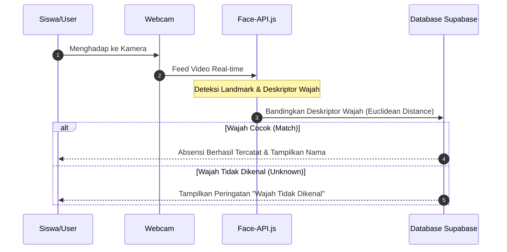

# Alur Kerja Sistem (Workflow) - FACE_ABSENSII

Sistem Absensi Deteksi Wajah berjalan dengan beberapa alur utama berikut:

## 1. Alur Registrasi Wajah & Siswa
1. Admin masuk ke halaman **Manajemen Siswa**.
2. Mengisi formulir data diri siswa (Nama, NIS, Kelas).
3. Mengunggah minimal satu foto wajah yang beresolusi baik dan jelas.
4. Sistem mengekstrak deskriptor wajah (128-dimensional vector) dari gambar tersebut lalu menyimpannya di Supabase.

## 2. Alur Proses Absensi (Presensi Real-time)
1. Siswa berdiri di depan kamera absensi.
2. Kamera menangkap feed video dan memproses frame demi frame menggunakan `face-api.js`.
3. `face-api.js` mendeteksi koordinat wajah dan menghitung kecocokan dengan data deskriptor yang terdaftar.
4. Jika tingkat kemiripan (threshold) terpenuhi, sistem mengirim request ke backend untuk mencatat jam kehadiran siswa ke database.
5. Suara atau pesan pop-up muncul menyatakan absensi berhasil.

## 3. Alur Rekapitulasi & Cetak Laporan
1. Admin membuka menu **Rekap Absensi**.
2. Memilih filter berdasarkan kelas dan rentang tanggal tertentu.
3. Meninjau ringkasan kehadiran (Hadir, Sakit, Izin, Alpha).
4. Klik tombol **Export Excel** atau **Export PDF** untuk mengunduh laporan secara instan.
