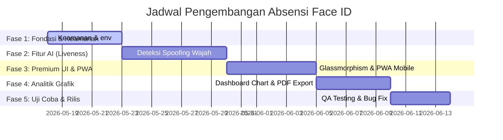

# 🚀 Rencana Pengembangan Proyek (Roadmap & Team Division)
## 📸 Sistem Absensi Face ID (Pengenalan Wajah) - Skala Kolaborasi (6 Anggota)

Dokumen ini disusun sebagai cetak biru (blueprint) pengembangan aplikasi **Sistem Absensi Face ID** untuk ke depannya. Dengan tim yang terdiri dari **6 orang**, proyek ini akan dibagi secara terstruktur berdasarkan spesialisasi masing-masing peran guna menghasilkan produk berskala produksi yang aman, cepat, dan premium.

---

## 👥 1. PEMBAGIAN PERAN & TUGAS (TEAM ROLES & RESPONSIBILITIES)

Untuk memastikan kolaborasi berjalan efisien tanpa tumpang tindih (*code conflict*), tugas dibagi menjadi 6 divisi utama dengan fungsi yang saling melengkapi:

| No | Peran (Role) | Penanggung Jawab | Deskripsi Tugas Utama | Cabang Git (*Branch*) |
| :--- | :--- | :--- | :--- | :--- |
| 1 | **Project Manager (PM) & Database Architect** | **Aldi Januar Saputra** | - Mengoordinasi seluruh tim & pembagian fitur.<br>- Melakukan *review code* & melakukan *merge* cabang kerja tim ke `main`.<br>- Optimalisasi skema database Supabase PostgreSQL (Indexing, Triggers, Views). | `main` & `aldii` |
| 2 | **Frontend UI/UX & PWA Engineer** | **Veve** | - Mendesain antarmuka premium (Glassmorphism & Dark Neon Theme) agar responsif di mobile.<br>- Mengonfigurasi **PWA (Progressive Web App)** agar aplikasi bisa diinstal di HP Android/iOS & bekerja offline. | `veve` |
| 3 | **AI & Computer Vision Specialist** | **[Anggota 3]** | - Optimalisasi performa `face-api.js` (kecepatan pencocokan & akurasi).<br>- Mengimplementasikan **Anti-Spoofing (Liveness Detection)** untuk mendeteksi kedipan mata/gerakan kepala agar siswa tidak bisa memalsukan absen memakai foto. | `ai-engine` |
| 4 | **Backend API & Cybersecurity Engineer** | **[Anggota 4]** | - Mengamankan koneksi database menggunakan library `php-dotenv` (menyembunyikan kredensial Supabase).<br>- Menulis API PHP yang aman, mencegah *SQL Injection*, & mengamankan *session* login admin/siswa. | `backend-security` |
| 5 | **Analytics & Dashboard Engineer** | **[Anggota 5]** | - Membuat fitur rekap absensi interaktif lengkap dengan grafik menggunakan **Chart.js**.<br>- Membuat fitur ekspor laporan kehadiran otomatis ke format **Excel (XLSX)** dan **PDF**. | `analytics-report` |
| 6 | **QA Tester & System Documentator** | **[Anggota 6]** | - Melakukan uji coba ketahanan pemindai wajah pada berbagai perangkat, pencahayaan, & sudut wajah.<br>- Menyusun dokumentasi teknis (API Spec) & Buku Panduan Pengguna (User Manual). | `qa-testing` |

---

## 🗺️ 2. PETA JALAN PENGEMBANGAN (DEVELOPMENT ROADMAP)

Pengembangan dibagi menjadi **5 Fase Utama** dalam rentang waktu terstruktur:



### 🔒 Fase 1: Pembenahan Fondasi & Keamanan (Backend-Security & PM)
* **Penyembunyian Kredensial**: Memindahkan isi `koneksi.php` yang berisi password Supabase agar tidak di-hardcode. Kita akan menggunakan file `.env` yang diabaikan oleh Git via `.gitignore`.
* **RBAC (Role-Based Access Control)**: Memisahkan hak akses login antara **Admin** (untuk mendaftarkan & menghapus siswa) dan **Guru/Siswa** (hanya melihat rekap).

### 👁️ Fase 2: Optimalisasi Deteksi Wajah & Anti-Cheating (AI Specialist)
* **Liveness Detection**: Mengukur kedipan mata atau sedikit pergerakan wajah (Landmarks distance fluctuation) untuk memastikan bahwa yang dipindai adalah manusia hidup secara live, bukan foto cetak atau layar HP.
* **Pre-loading Models**: Optimasi cache model `face-api.min.js` di browser lokal agar kamera terbuka lebih instan tanpa delay mengunduh ulang model AI seberat puluhan MB.

### 📱 Fase 3: UI/UX Glassmorphism Premium & PWA Mobile (UI/UX Engineer)
* **Mobile First Design**: Mengubah tata letak halaman `absensi.php` dan `register.php` agar pas 100% saat diakses lewat layar smartphone guru/siswa di lapangan.
* **Progressive Web App (PWA)**: Membuat file `manifest.json` dan *Service Worker* javascript agar web ini bisa ditambahkan ke Home Screen layaknya aplikasi native Android/iOS dengan fitur *splash screen*.

### 📊 Fase 4: Grafik Analitik & Ekspor Data (Analytics Engineer)
* **Interactive Dashboard**: Mengubah halaman statistik menjadi visualisasi dashboard admin yang memukau (grafik kehadiran harian, persentase keterlambatan per kelas menggunakan `Chart.js`).
* **Instant Export**: Menyediakan tombol sekali klik untuk mengekspor database absensi ke file `.xlsx` menggunakan library **PhpSpreadsheet** secara langsung tanpa membebani browser.

### 🧪 Fase 5: Pengujian Kualitas & Dokumentasi Akhir (QA & PM)
* **Edge-case Testing**: Pengujian pemindaian wajah pada ruangan minim cahaya (under-exposure) dan ruangan sangat terang (backlight).
* **Final Release Merge**: Project Manager melakukan peninjauan akhir pada seluruh cabang tim, menyatukannya ke cabang `main`, dan mendeploy aplikasi ke hosting web PHP.

---

## 🤝 3. PROTOKOL KOLABORASI GIT (GIT COLLABORATION PROTOCOL)

Untuk menghindari bentrokan kode (*code conflict*) selama pengerjaan, seluruh tim wajib mematuhi aturan berikut:

1. **Dilarang keras melakukan Push langsung ke branch `main`!** Cabang `main` dilindungi dan hanya boleh di-update melalui integrasi PM.
2. **Alur Aliran Kode**:
   * Setiap anggota membuat cabang baru dari `main` saat ingin mulai bekerja: `git checkout -b <nama-cabang-baru>`.
   * Setelah fitur selesai dibuat dan diuji secara lokal, dorong ke GitHub: `git push origin <nama-cabang-kerja>`.
3. **Pemeriksaan PM**:
   * PM akan memeriksa perubahan, menguji di komputer lokal, lalu menggabungkannya ke `main` jika sudah stabil:
     ```powershell
     git checkout main
     git merge origin/<nama-cabang-kerja>
     git push origin main
     ```

---

*Dibuat oleh Tim Pengembang Face Attendance ID dengan semangat kolaborasi.* ❤️
