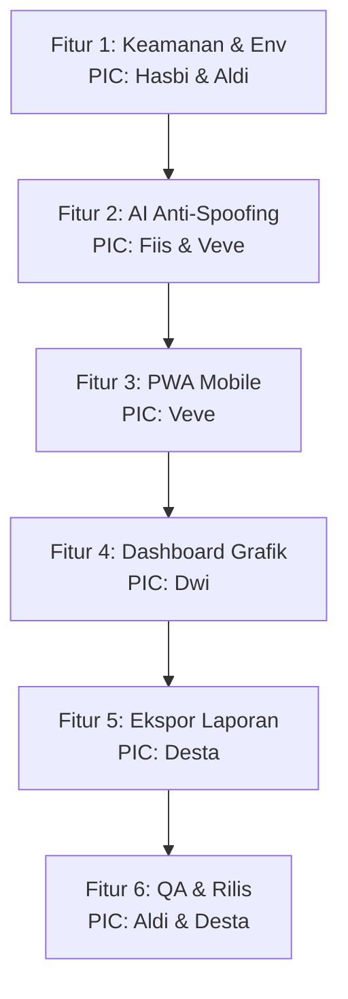

# 🚀 Rencana Pengembangan Proyek Berbasis Fitur (Feature-Driven Roadmap)
## 📸 Sistem Absensi Face ID (Pengenalan Wajah) - Skala Kolaborasi (6 Anggota)

Dokumen ini adalah cetak biru (*blueprint*) kerja kolaborasi tim untuk masa depan. Agar koordinasi antar **6 anggota tim** berjalan lancar tanpa tumpang tindih kode (*code conflict*), pengerjaan dibagi secara terstruktur **berdasarkan FITUR utama** yang ditugaskan secara personal kepada masing-masing anggota tim dengan cabang Git (*branch*) tersendiri:

---

## 👥 DAFTAR ANGGOTA TIM & CABANG GIT (BRANCH LIST)

Sebagai Project Manager, Anda telah berhasil membuat dan menyetel cabang kerja khusus di GitHub untuk seluruh tim:

1. **Aldi** (Project Manager & Database Lead) ➡️ Branch: `aldii`
2. **Fiis** (AI Engine Specialist) ➡️ Branch: `fiis`
3. **Veve** (Frontend Designer & UI/UX) ➡️ Branch: `veve`
4. **Hasbi** (Backend & Security Developer) ➡️ Branch: `hasbi`
5. **Dwi** (Analytics & Chart Developer) ➡️ Branch: `dwi`
6. **Desta** (Reporting & QA Specialist) ➡️ Branch: `desta`

---

## 🛠️ PEMBAGIAN TUGAS PER FITUR UTAMA (FEATURE BREAKDOWN)



---

### 🔒 FITUR 1: Sistem Keamanan & Autentikasi Admin-Guru
Fitur ini berfokus pada pengamanan database Supabase, pencegahan SQL Injection, dan pembatasan hak akses halaman kelola data agar tidak bisa ditembus sembarang orang.
* **Penanggung Jawab (PIC)**: **Hasbi** (Lead) & **Aldi** (Assisting)
* **Cabang Git (*Branch*)**: `hasbi`
* **Daftar Tugas (TODO)**:
  - [ ] Memisahkan kredensial Supabase dari `koneksi.php` menggunakan library `php-dotenv` via file `.env`.
  - [ ] Membuat halaman login Admin & Guru yang aman dengan enkripsi password (`password_hash`).
  - [ ] Implementasi manajemen *session* di PHP agar halaman `siswa.php` dan `rekap.php` tidak bisa diakses langsung via URL tanpa login.
  - [ ] Melakukan sanitasi input seluruh formulir menggunakan Prepared Statements (PDO).

---

### 👁️ FITUR 2: Deteksi Keaktifan Wajah (Anti-Spoofing / Liveness Detection)
Meningkatkan akurasi AI dan mencegah kecurangan absensi siswa menggunakan foto cetak atau layar HP.
* **Penanggung Jawab (PIC)**: **Fiis** (Lead) & **Veve** (Assisting on UI/UX)
* **Cabang Git (*Branch*)**: `fiis`
* **Daftar Tugas (TODO)**:
  - [ ] Mengimplementasikan logika deteksi kedipan mata (*eye-blinking detection*) atau deteksi jarak pergerakan landmark wajah (*head movement*) pada `absensi.php` menggunakan model 68 Landmark `face-api.js`.
  - [ ] Optimasi caching browser lokal untuk model AI SSD Mobilenet v1 agar kamera terbuka instan tanpa delay mengunduh ulang model.
  - [ ] Mendesain indikator garis pemindaian wajah (*bounding box*) real-time yang estetis pada UI.

---

### 📱 FITUR 3: PWA Mobile & Responsive Design
Mengubah aplikasi web menjadi Progressive Web App agar bisa diinstal di Android/iOS layaknya aplikasi asli dengan tampilan premium yang ramah layar smartphone.
* **Penanggung Jawab (PIC)**: **Veve** (Lead)
* **Cabang Git (*Branch*)**: `veve`
* **Daftar Tugas (TODO)**:
  - [x] Menyusun file `manifest.json` dan *Service Worker* javascript untuk caching aset CSS, JS, dan gambar secara offline.
  - [x] Mendesain ulang layout CSS `absensi.php` and `register.php` menjadi *Mobile-First Design* menggunakan Glassmorphism dan warna neon.
  - [x] Membuat *splash screen* (layar pemuatan) dan ikon aplikasi khusus saat diinstal di HP.

---

### 📊 FITUR 4: Dashboard Analitik Grafik (Chart.js)
Membuat halaman statistik kehadiran harian dan bulanan yang interaktif bagi admin untuk mempermudah monitoring siswa.
* **Penanggung Jawab (PIC)**: **Dwi** (Lead)
* **Cabang Git (*Branch*)**: `dwi`
* **Daftar Tugas (TODO)**:
  - [ ] Integrasi library **Chart.js** pada halaman utama dashboard admin.
  - [ ] Membuat grafik kehadiran harian (Hadir vs Lambat) dan persentase kehadiran per kelas.
  - [ ] Membuat widget ringkasan statistik (Total Siswa Terdaftar, Hadir Hari Ini, Terlambat Hari Ini, Tanpa Keterangan).

---

### 📥 FITUR 5: Ekspor Laporan Otomatis (Excel & PDF)
Menyediakan fitur sekali klik bagi guru/admin untuk mengunduh laporan kehadiran resmi untuk kebutuhan administrasi.
* **Penanggung Jawab (PIC)**: **Desta** (Lead)
* **Cabang Git (*Branch*)**: `desta`
* **Daftar Tugas (TODO)**:
  - [ ] Mengintegrasikan library **PhpSpreadsheet** di backend PHP untuk ekspor data kehadiran langsung ke format `.xlsx`.
  - [ ] Membuat fitur unduh laporan rekap bulanan per siswa ke format **PDF** resmi.
  - [ ] Membuat filter pencarian cepat berdasarkan rentang tanggal dan nama kelas sebelum mengekspor data.

---

### 🧪 FITUR 6: Penjaminan Mutu & Uji Ketahanan (QA & Rilis)
Memastikan seluruh fitur stabil, responsif, bebas error, serta didukung panduan penggunaan yang lengkap.
* **Penanggung Jawab (PIC)**: **Aldi** (Lead PM) & **Desta** (Assisting on QA)
* **Cabang Git (*Branch*)**: `aldii`
* **Daftar Tugas (TODO)**:
  - [ ] Melakukan uji coba ketahanan pemindai wajah pada berbagai perangkat (HP RAM rendah, laptop, kamera USB luar).
  - [ ] Menguji performa API Supabase saat beberapa user melakukan absen secara bersamaan.
  - [ ] Menyusun dokumen dokumentasi teknis (API Spec) & Buku Panduan Pengguna (User Manual).
  - [ ] **Project Manager (Aldi)**: Melakukan review kode pada seluruh branch pengembang tim, lalu menyatukannya ke cabang `main` setelah dinyatakan bebas bug.

---

## 🤝 PROTOKOL KOLABORASI GIT TIM (PM RULES)

1. **Dilarang keras melakukan Push langsung ke branch `main`!** Cabang `main` dilindungi dan hanya boleh di-update oleh Project Manager melalui integrasi kode.
2. **Alur Kerja Pengembang (Tim)**:
   - Pengembang berpindah ke cabang masing-masing: `git checkout <nama-cabang>`.
   - Mengambil update terbaru dari `main` secara rutin: `git pull origin main`.
   - Lakukan pengerjaan, commit, dan push langsung ke cabang masing-masing: `git push origin <nama-cabang>`.
3. **Pemeriksaan PM (Aldi)**:
   - Ambil update dari GitHub: `git fetch origin`.
   - Pindah dan uji cabang teman Anda secara lokal: `git checkout <nama-cabang>`.
   - Jika sudah oke, kembali ke `main`, gabungkan, dan dorong:
     ```powershell
     git checkout main
     git merge origin/<nama-cabang>
     git push origin main
     ```

---
*Dibuat oleh Tim Pengembang Face Attendance ID dengan semangat kolaborasi.* ❤️
